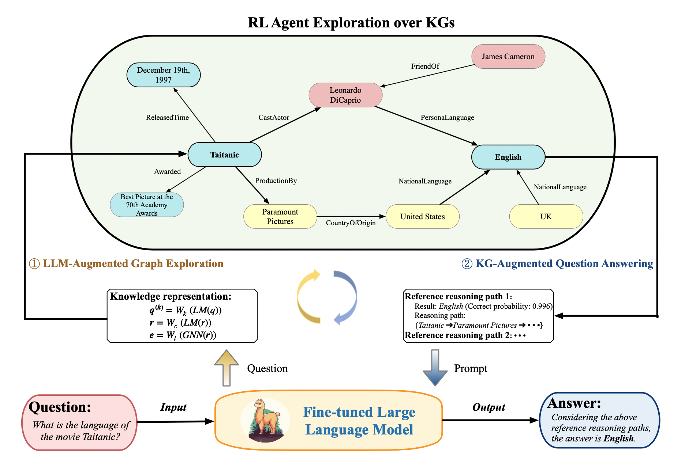

# Code of TATE

Pytorch Implementation for the paper: Think and then Explore: Bridging Knowledge Graph Structural Modality with LLMs via RL-Augmented Reasoning.

We're currently restructuring our codebase to improve clarity and reproducibility. The experimental versions contain redundant code segments that may hinder readers' ability to replicate our work. In this initial release, we're making the Path Exploration Module publicly available. The Thinking Module will be released in the near future. We appreciate your patience during this reorganization process.

## Framework Overview
<p align="center">

</p>

While large language models (LLMs) have achieved remarkable success across various domains through large-scale pretraining, their application to complex knowledge reasoning tasks exposes critical limitations, including outdated information, hallucinations, and opaque decision-making processes. Knowledge graphs (KGs) mitigate these issues by providing structured, editable representations of real-world knowledge. However, current approaches combining LLMs and KGs still grapple with three critical challenges:  (1) LLMs' inherent inability to comprehend KG structure, hindering effective knowledge traversal; (2) computational inefficiency from tightly coupled cross-modal interactions; and (3) proliferation of semantically inconsistent reasoning paths. In this paper, we propose TATE, a novel framework that synergistically integrates LLM-based reasoning with reinforcement learning (RL) through iterative cross-modal interaction. TATE introduces: (1) an innovative LLM-RL synergy within an adaptive retrieval-augmented generation framework, effectively combining LLMs' language comprehension with RL's reasoning path exploration capabilities; (2) a novel RL reward mechanism guided by LLMs to mitigate spurious reasoning paths, ensuring logical valid and KG-grounded semantic reasoning trajectories. Extensive experiments on KGQA and KGC benchmarks show TATE achieves state-of-the-art performance, outperforming GPT-4's performance with an 8B tuned LLM. Our framework establishes a new paradigm for scalable, structure-aware integration of LLMs and KGs for cross-modal reasoning.

## Requirements
<!-- To install the various python dependencies (including pytorch) -->
```
pip install -r requirements.txt
```


## Training & Testing
The hyperparam configs for each experiments are included in the configs directory. To start a particular experiment, just do
```
sh run.sh configs/${dataset}.sh
```
where the `${dataset}.sh` is the name of the config file. For example, 
```
sh run.sh configs/fb15k-237.sh
```

